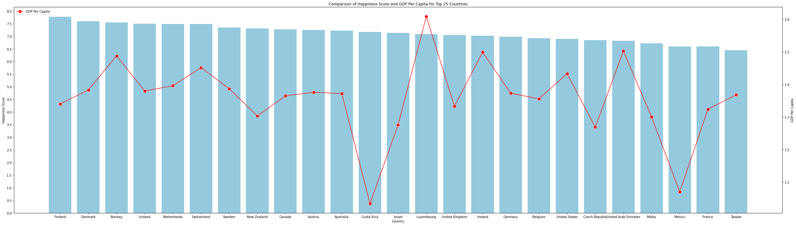

# World Happiness Report 2019 Analysis

## Overview

This project is an exploration and analysis of the 2019 World Happiness Report dataset. The dataset contains information about happiness scores and various economic and social indicators for 156 countries. The goal of this project is to uncover insights into global happiness and understand its relationship with economic indicators like GDP per capita.

## Motivation

The World Happiness Report provides valuable data that can help us understand the factors contributing to the happiness of different countries. By analyzing this dataset, we aim to answer key questions, such as:

- Where are the happiest countries?
- What patterns can be found in the happiness levels across different countries?
- Does money (GDP per capita) correlate with happiness?

## Data Source

The dataset used in this project is sourced from Kaggle: [World Happiness Report Dataset](https://www.kaggle.com/datasets/unsdsn/world-happiness/). It contains various metrics, such as "Happiness Score," "GDP per capita," "Social Support," "Healthy Life Expectancy," and more.

## Key Findings

- **Happiest Countries**: The top 10 countries with the highest happiness scores include Finland, Denmark, Norway, Iceland, the Netherlands, and others.
- **Happiness Patterns**: There is a noticeable pattern where countries with high happiness scores also have strong economic indicators.
- **Correlation Between Happiness and Wealth**: A positive correlation was observed between GDP per capita and happiness scores, suggesting that economic prosperity contributes significantly to overall happiness.

## Data Analysis

The analysis was conducted using Python, leveraging libraries such as `pandas` for data manipulation, `seaborn` and `matplotlib` for data visualization, and `numpy` for numerical operations.

### Analysis Steps

1. **Data Import and Cleaning**: The dataset was loaded, and unnecessary columns were removed. Duplicate rows were also dropped, and columns were renamed for clarity.
   
2. **Descriptive Statistics**: Summary statistics were generated to understand the distribution and spread of data points.
   
3. **Data Visualization**: Various plots, including bar plots and line plots, were created to visualize the relationship between happiness scores and GDP per capita for different countries.

4. **Key Comparisons**: Comparisons were made between the top 10 and bottom 10 countries based on their Happiness Scores and GDP per capita to uncover deeper insights.

## Visualizations

The project includes several visualizations:

- **Top 10 Countries by Happiness Score**: A bar plot depicting the happiness scores of the top 10 countries.
- **Happiness vs. GDP per Capita**: A combined bar and line plot comparing the happiness scores and GDP per capita for the top 25 countries.
- **Comparison of Top 10 and Bottom 10 Countries**: Visual comparisons of happiness scores and GDP per capita for both the happiest and least happy countries.
- **All Countries Happiness Score**: A bar plot showing the happiness score of all countries with a line plot overlay representing GDP per capita.

### Sample Visualization

Below is a sample visualization from the analysis that shows the relationship between Happiness Scores and GDP per Capita:



*Figure: Combined Bar and Line Plot Comparing Happiness Scores and GDP per Capita for the Top 25 Countries.*

## Conclusion

The analysis of the 2019 World Happiness Report dataset shows a strong positive correlation between GDP per capita and happiness scores. Countries with higher economic prosperity, as measured by GDP per capita, generally report higher levels of happiness. This finding suggests that economic stability and prosperity significantly impact global happiness.

## Requirements

To run this analysis, you need the following Python libraries:

- pandas
- numpy
- matplotlib
- seaborn

## Install the Required Packages Using pip:

```bash
pip install pandas numpy matplotlib seaborn


## How to Run

1. **Clone this repository:**

    ```bash
    git clone https://github.com/Haider425/happinessEDA.git
    ```

2. **Navigate to the project directory:**

    ```bash
    cd happinessEDA
    ```

3. **Run the Jupyter Notebook or Python script to see the analysis and visualizations:**

    ```bash
    jupyter notebook analysis.ipynb
    ```
